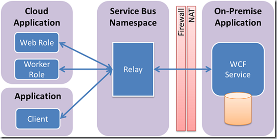
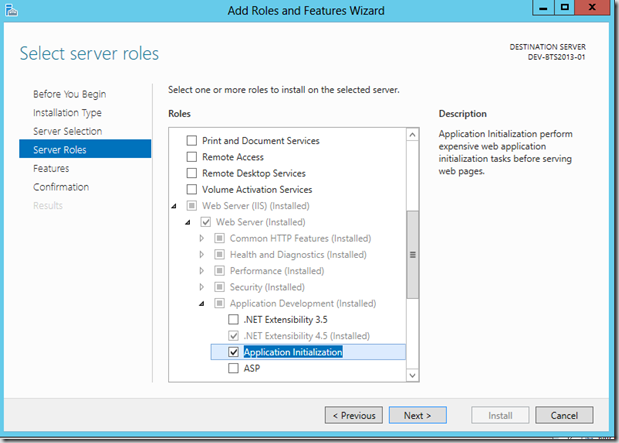
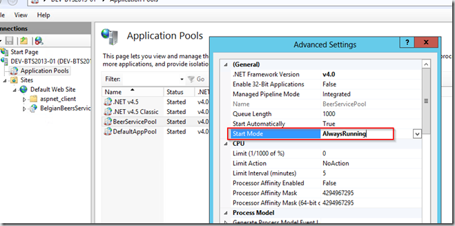
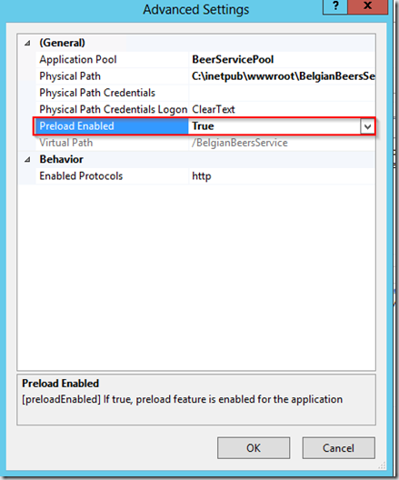

A common scenario of using Azure Service Bus relay is when you what to expose an on-premise WCF service to a cloud application or business partner without changing your existing firewall configuration. 

The main challenge with this setup is related to IIS aplication activation. [MSDN](http://http://msdn.microsoft.com/en-us/library/hh966775.aspx) explains why:

> By default, IIS initializes a web application when the first request is received.
> 
> However, for the on-premises WCF service with a Service Bus relay binding to start receiving messages from Service Bus in the cloud, the on-premises service has to open an outbound port and create a bidirectional socket for communication. It connects to Service Bus, authenticates itself, and starts listening to messages before the client sends its requests. The relay service sends messages to the on-premises service through the bidirectional socket already in place.
> 
> Similarly, a “messaging” binding provides an automatic messaging pump that pulls messages from a queue or a subscription, and is integrated into the WCF ReceiveContext mechanism. This binding also has to initiate an outbound connection to Service Bus in the cloud, and authenticate itself before the message pump is activated.
> 
> Because IIS and the Windows Activation Service (WAS) rely on message-based activation, by default the web applications hosted in IIS/WAS are initialized only after the first request comes in. Therefore, the usual IIS/WAS message-based activation does not work for WCF services with Service Bus bindings, because these bindings must first establish an outgoing connection to the service in order to receive messages. **This requirement means that when hosted on IIS, such WCF services must be explicitly initialized, or they require alternate mechanisms to automatically initialize the application.**

 

With IIS 8 we can use the built-in [Application Initialization](http://www.iis.net/learn/get-started/whats-new-in-iis-8/iis-80-application-initialization) to “warm up” our WCF Services when IIS starts.

## Step 1 – Add the Application Initialization Role

Add the Application Initialization Role under Web Server (IIS) => Web Server => Application Development 

## Step 2 – Configure the Application Pool

Set the **Start Mode** of the Application Pool your WCF Service is running under to AlwaysRunning.

[

## Step 3 – Configure the Web Application

Set the **Preload Enabled** setting of the Web Application to True.

[

## Step 4 – Edit the Web.Config

The final step is to edit your Web.Config and add the "applicationInitialization" element. In this code snippet below, “BeerService.svc” is my service to be initialized.

<system.webServer>
  <applicationInitialization>
    <add initializationPage="/BeerService.svc" />
  </applicationInitialization>   
</system.webServer>

## Conclusion

Thanks to IIS 8 it is very simple to "warm up" your WCF Services and to be sure that your services will be available through Azure Bus relay after an IIS (re)start. Also there is no more need to use AppFabric only for this feature.
