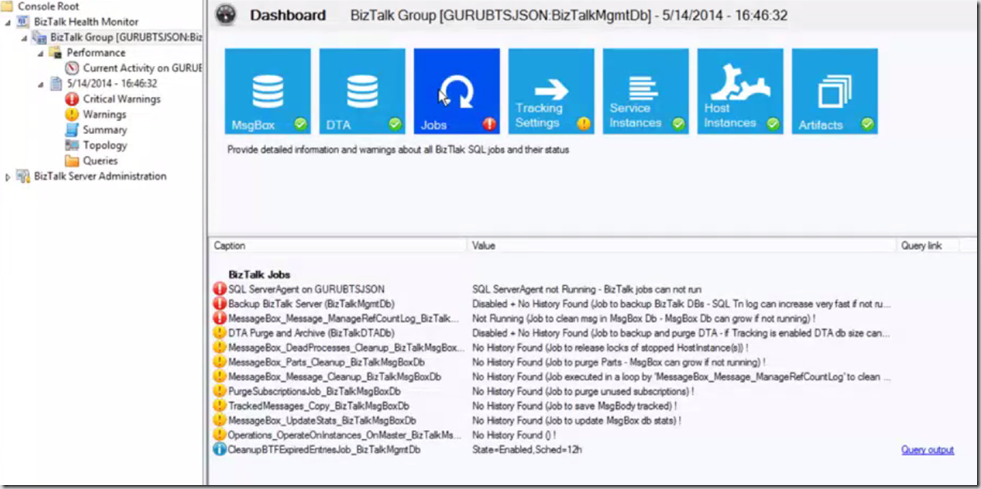

BizTalk 2013 R2 is soon to be released to the public and can be seen as a (minor) platform update in the first place. Besides this, there are also updates to some adapters. An overview can be found here on MSDN: [What's New in BizTalk Server 2013 and 2013 R2](http://msdn.microsoft.com/en-us/library/jj248703(v=bts.80).aspx).

Except the support for JSON on the WCF-WebHttp adapter, we cannot expect anything spectacular in my opinion. Or is it…?

An exciting new feature that isn’t mentioned on MSDN anywhere, is the BizTalk Health Monitor:

BizTalk Health Monitoring groups a number of already existing elements into the BizTalk Management Console. Some features that I was able to spot:

- Integration of the MessageBox Viewer tool
- Performance analysis thanks to integrated PerfMon
- Eeasy SQL Job Status monitoring
- Automatic Archiving of Health reports

You can view Guru Venkataraman speak in the screencast below on these new features of BizTalk 2013 R2 at TechEd North America 2014, beginning at 10:30. To view the part about BizTalk Health Monitor skip directly to 34:35.

<iframe style="height: 540px; width: 960px;" src="http://channel9.msdn.com/Events/TechEd/NorthAmerica/2014/DEV-B364/player?h=540&amp;w=960" width="300" height="150" frameborder="0" scrolling="no" allowfullscreen="allowfullscreen"></iframe>
