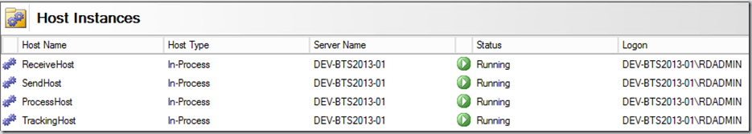

A common task when setting up a new BizTalk environment, is to create hosts and associated host instances. If we want to follow best practices, this means that we have to create at least four hosts (ReceiveHost, SendHost, ProcessHost, TrackingHost) and 4 host instances.

Fortunately, we can automate this task thanks to [the BizTalk PowerShell Provider](https://psbiztalk.codeplex.com/)!

