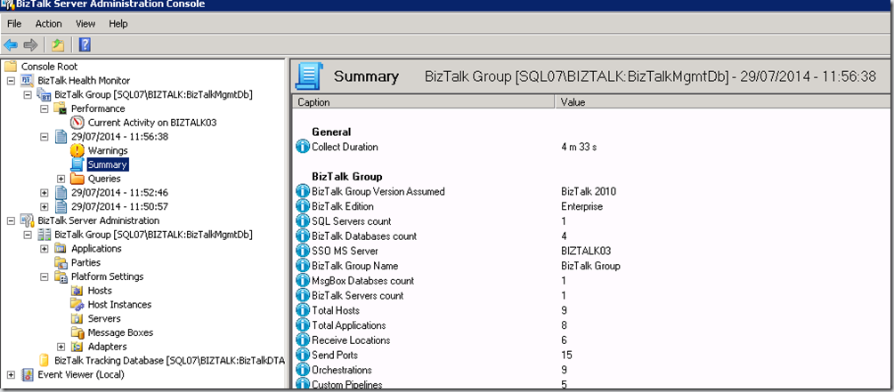

The question if it’s possible to run the BizTalk Health Monitor on BizTalk 2010, was raised by [steveculshaw](http://blogs.msdn.com/547006/ProfileUrlRedirect.ashx) on MSDN blogs [here](http://blogs.msdn.com/b/biztalkhealthmonitor/archive/2014/06/26/overview-of-biztalk-health-monitor-bhm.aspx#10543195). The answer is simply yes. In fact, it’s even possible to run it on older versions of BizTalk Server:

> BHM is also working perfectly for BizTalk 2010. It is sharing in fact the Health Check framework and repository of  MsgBoxViewer (MBV) which can target any BizTalk versions since 2004. – [JP](http://blogs.msdn.com/b/biztalkhealthmonitor/archive/2014/06/26/overview-of-biztalk-health-monitor-bhm.aspx#10544732)

The only problem for now is, that it’s not yet available as a separate download. This makes that you need to get a copy of the BizTalk 2013 R2 installation disk first, before you can install it on previous versions of BizTalk Server. The good news is, that it will become available soon.

Finally, some proof that it is indeed possible to run the BizTalk Health Monitor on BizTalk 2010:

The installation procedure is exactly the same like you would do on BizTalk 2013 R2, as I explained in a previous blog post [here](http://blog.jeroenmaes.eu/2014/06/enable-biztalk-health-monitor-biztalk-2013-r2/).
