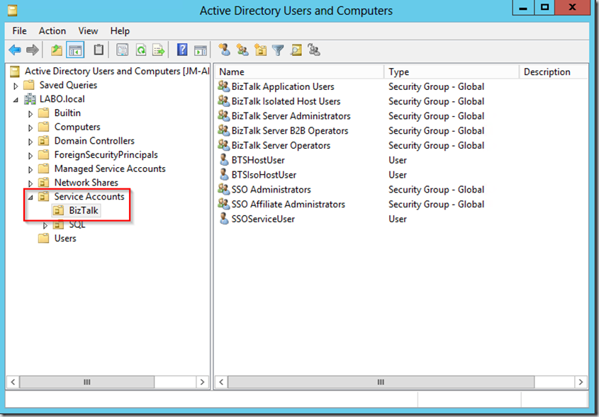

When installing and configuring a new BizTalk Server environment, a part of the job consist of creating a collection of [windows accounts and groups](http://msdn.microsoft.com/en-us/library/aa577661.aspx). Most of the time you will not be the person that has the necessary rights in Active Directory to complete this job. Having a script that you can hand over to the Active Directory admin can save you a lot of time in redundant communication.

With PowerShell you can complete this time consuming task in a couple of seconds.

The scripts is provided AS IS and may not be directly usable for your situation, but you can use it as a start for your own script.

The result of the script:

