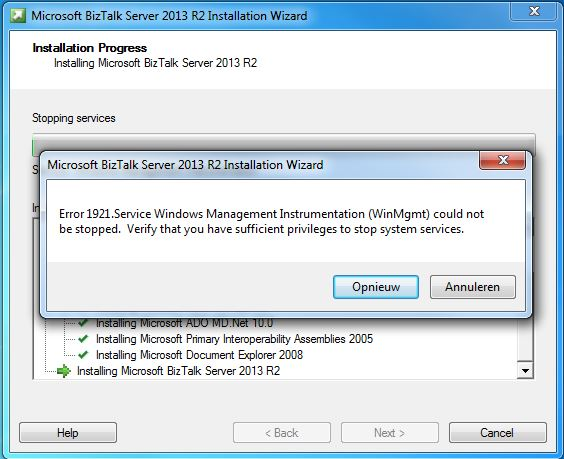
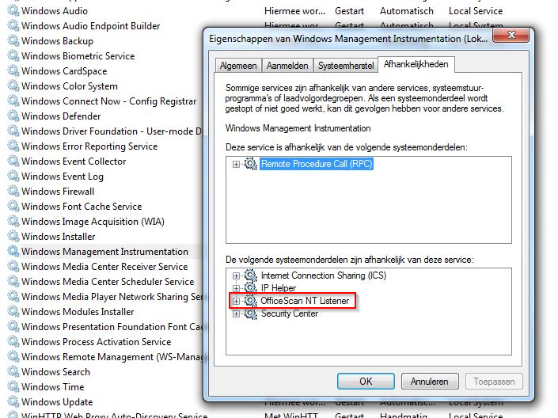
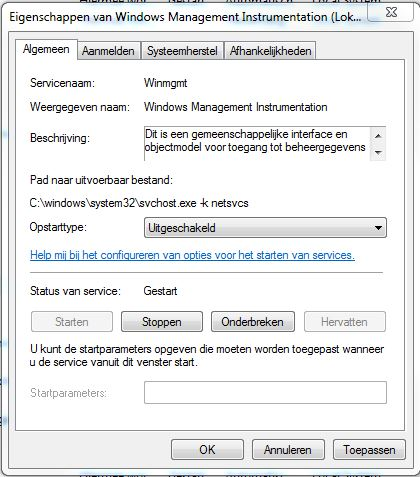
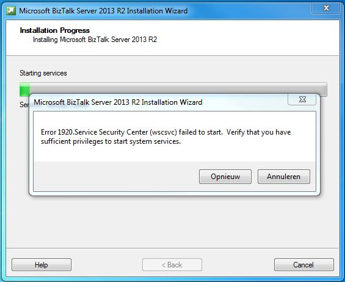
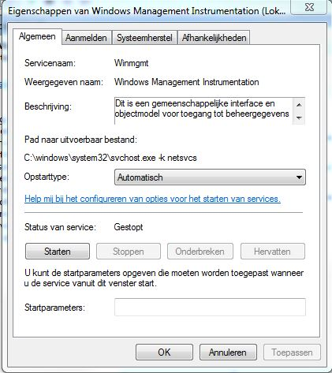

**The Problem:**

When installing BizTalk 2013 R2 on a fresh development machine, I encountered the following error: "Error 1921.Service Windows Management Instrumentation (WinMgmt) could not be stopped. Verify that you have sufficient privileges to stop system services."

As my "Trend Micro Office ScanAgent" (the OfficeScan NT Listener in the screenshot) was dependant of the "Windows Management Instrumentation service", I was not able to stop it manually:

**The Solution:**

However: I was able to change the startup type of the WMI service:

So change to startup type of the WMI service to "Disabled", do a Windows restart and you should be able to re-run the BizTalk installer without the previous error... You will however experience a new error...

This makes sense as we completely disabled the WMI service. So, change the startuptype back to "Automatic" and start the WMI service yourself (this should be possible now):

