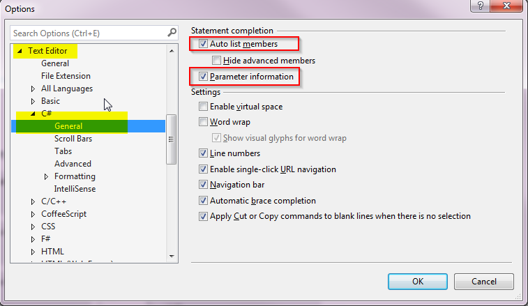
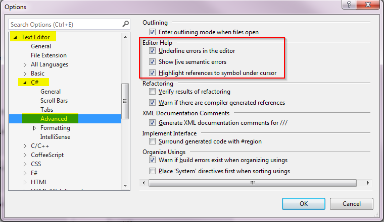

**The Problem:** After removing ReSharper on a dev machine with only a trail license, it felt like my Visual Studio was broken (And not just because I no longer had the great features of ReSharper to use...). My intellisense and editor help were completely gone, making my Visual Studio just an ordinary text editor...

**The Solution:** Check your Visual Studio settings and reset them to the following defaults:

A restart of VIsual Studio may be necessary after resetting this.

_Related Resources:_

- [http://rion.io/2013/06/28/a-battle-of-intellisense](http://rion.io/2013/06/28/a-battle-of-intellisense/)
