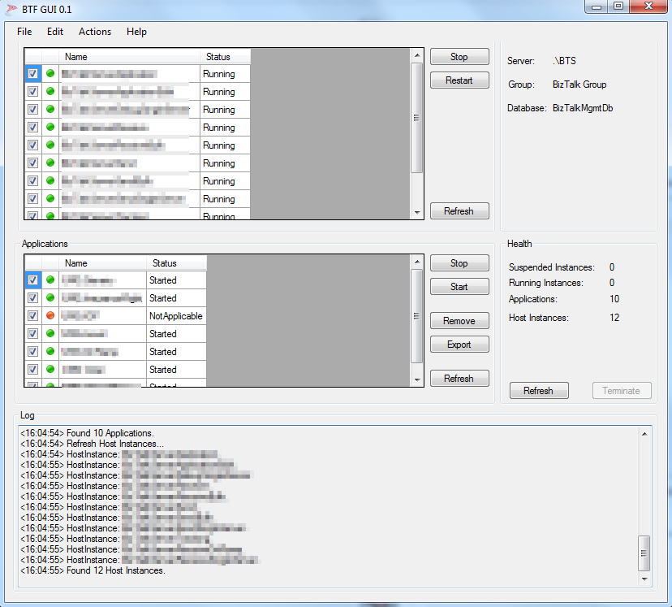

Today I published one of my little projects on GitHub. It's called BTFGui and in essence it is just a simple GUI around the [BizTalkFactory Management Automation (SDK)](https://psbiztalk.codeplex.com/#biztalkfactory_management_automation) to do some basic BizTalk Administration.

Currently it has the following features:

- Stop/Restart HostInstances
- Stop/Restart Applications
- Remote Applications
- Export Application Bindings
- Terminate Suspended Instances

You can find It [here](https://github.com/jeroenmaes/BTFGui) on GitHub.

The main reason why I put this little thing together is simple: the BizTalk Administration Console can be very slow and time wasting if you just want to restart a hostinstance or export a binding. Therefore I created BTFGui and I can tell you that it saves me a lot of time when developing on my local BizTalk Server instance.
