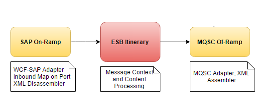
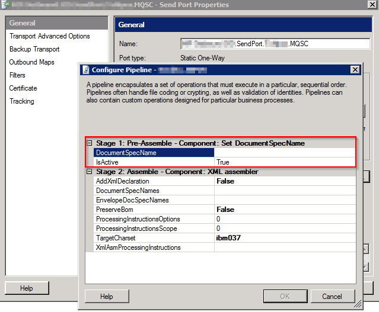

Normally when you receive an exception with the message "The document type does not match any of the given schemas" in BizTalk, this means your schemas are not (yet) deployed, your are missing an application reference to the project containing your schemas or you have a configuration mistake in your pipeline.

This time, unfortunately, it was not the normal case.

### The integration scenario

 

### The cause

In our ESB Itinerary Processing stage, we copy/alter most of the incoming context properties. One of the properties copied is the "DocumentSpecName". This one, was the one responsible for chocking up our send pipeline. (Read [this post](https://adventuresinsidethemessagebox.wordpress.com/2012/09/03/the-document-type-does-not-match-any-of-the-given-schemas-encountered-in-an-xml-disassemblerassembler-based-scatter-gather-scenario/) by Johann for some more info on the subject and other possible scenarios where you might experience this behaviour)

### The fix

We choose to reset (= write null) the value of the "DocumentSpecName" property in the "Pre-Assemble" stage in our send pipeline. To make sure the XML Assembler doesn't choke up.

The code used to reset the the DocumentSpecName in the "Set DocumentSpecName" PipelineComponent:

private void DoWrite(Microsoft.BizTalk.Message.Interop.IBaseMessage inmsg)
{ 
if (!string.IsNullOrEmpty(DocumentSpecName))
inmsg.Context.Write("DocumentSpecName", "http://schemas.microsoft.com/BizTalk/2003/xmlnorm-properties", DocumentSpecName);
else
inmsg.Context.Write("DocumentSpecName", "http://schemas.microsoft.com/BizTalk/2003/xmlnorm-properties", null);

outMsg = inmsg;
}
