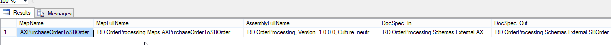

In a current integration scenario we are heavily using [dynamic transforms](https://msdn.microsoft.com/en-us/library/aa950573.aspx) in our solution. The combination with the Business Rules Engine (that holds the logic to determine the required output message version) makes it possible to map to the desired message format and version for a given partner.

The problem in our case was that we don't now the version of the assembly that holds the BizTalk maps (caused by our build server setup). Otherwise we would have been able to store the MapName and AssemblyName in the BRE like showcased in [this MSDN sample](https://code.msdn.microsoft.com/BizTalk-Server-Dynamic-6332ccc8). Thanks to this query against the BizTalkMgmtDb we are able to find the correct map currently deployed on BizTalk Server. The query needs the incoming message type and the destination message type. (in our solution the destination message type is dynamically returned by the BRE)

Sample output of the query:

