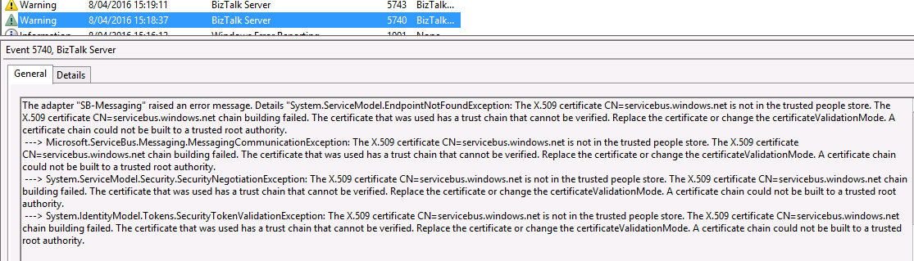
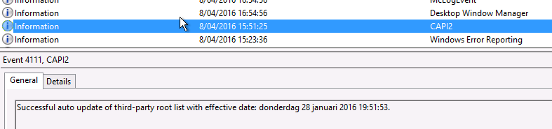

**The Problem:**

After configuring a brand new BizTalk 2013R2 production environment and requesting the needed firewall exclusions to the security department, we were unable to send messages to Azure ServiceBus using the SB-Messaging adapter in BizTalk 2013R2 (using ACS authentication). We found the following warning in the EventLog:

> The adapter "SB-Messaging" raised an error message. Details "System.ServiceModel.EndpointNotFoundException: The X.509 certificate CN=servicebus.windows.net is not in the trusted people store. The X.509 certificate CN=servicebus.windows.net chain building failed. The certificate that was used has a trust chain that cannot be verified. Replace the certificate or change the certificateValidationMode. A certificate chain could not be built to a trusted root authority.
> 
> 

 

**The Solution:**

Thanks to [this](http://stackoverflow.com/questions/24171931/azure-hosted-service-bus-the-x-509-certificate-cn-servicebus-windows-net-is-n) post on StackOverflow I was able to fix the problem by "auto installing" the missing certificate.

The following steps solved our problem:

1. Configure the company web proxy needed for internet connectivity on the server used by BizTalk for ServiceBus connectivity
2. Use a .NET console test application to send/receive a dummy message to an Azure ServiceBus test queue
3. Remove the web proxy config
4. Repeat on every server
5. Test using the BizTalk SB-Messaging Adapter

 

After using the console test application, we got the following info message in the eventlog:

 

Small sidenote regarding the .NET console test application, make sure you use the "AutoDetect" connectivity mode:

ServiceBusEnvironment.SystemConnectivity.Mode = ConnectivityMode.AutoDetect;
