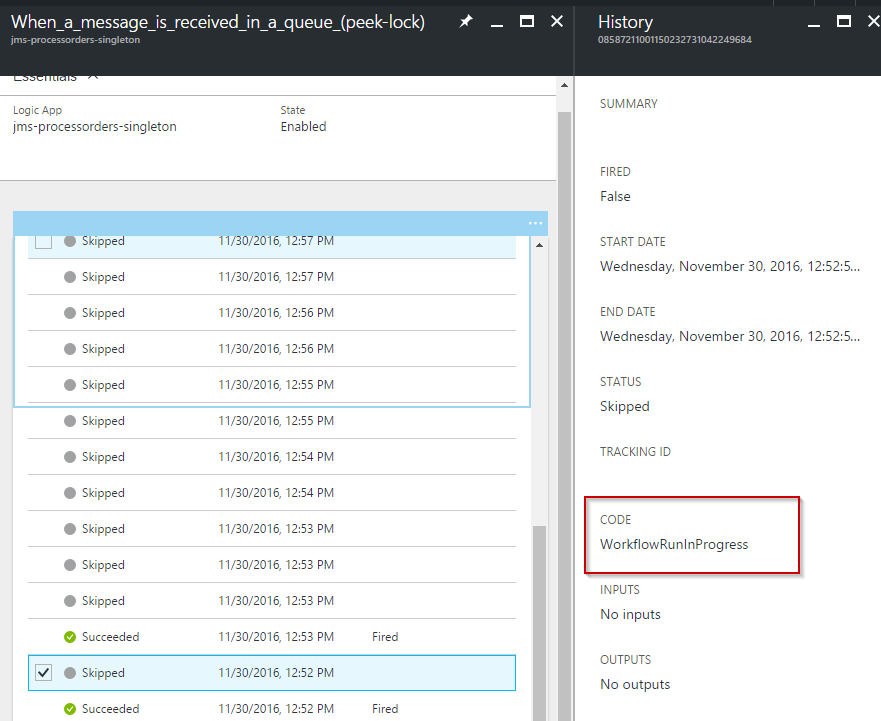
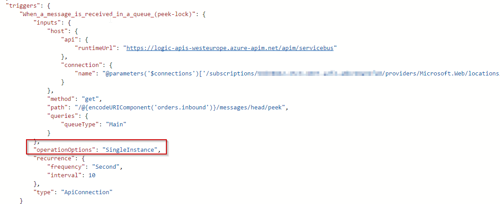

Since the release update of [2016-11-18](http://(https://blogs.msdn.microsoft.com/logicappsupdate/2016/11/18/release-update-2016-11-18/)  we can now mark a Logic App trigger as "Singleton".

Which results in a Logic App that will run as only one instance at a time. To be more precise: it is the trigger who will not fire unless the previous instance of the Logic App has fully completed.

A trigger which was skipped because of a running instance will result in a "WorkflowRunInProgress" code.

 

# Marking a trigger as singleton

Currently there is no possibility to mark a trigger as singleton in the designer. You need to switch to codeview and add the following at the same level as the recurrence property.

"operationOptions": "SingleInstance",

As soon as you save, the setting will become active and your Logic App will run as a singleton.
