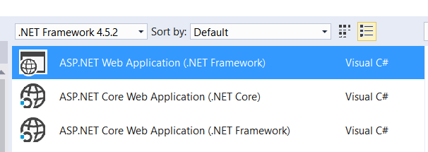
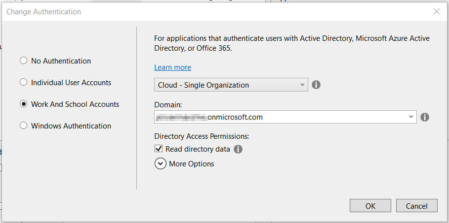
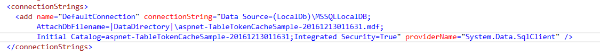
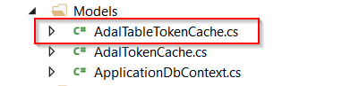

_Outline: In this post I will talk about the possibility to replace a SQL Database as the ADAL token cache in the default Visual Studio ASP.NET MVC Template. The replacement data store will be Azure Table Storage._

At a recent project we where using an ASP.NET MVC Website to present data located in Azure Table Storage. The application was using Azure Active Directory for its Authentication.

When creating an ASP.NET MVC Site and adding Azure Active Directory for Authentication, the Template will add a ConnectionString to a Database to use for the ADAL Token Caching:

When you deploy this to an Azure Website you will need to use an Azure SQL Database. Using LocalDb in Azure is not possible. (The Publish tool in Visual Studio guides you in this.)

After deploying this the first time to Azure we ended up with 2 storage backends: Azure SQL Databse (for Authentication) and Azure Table Storage (for the real Business Data). As the SQL Database was only used for the ADAL Tokens, we surely wanted to get rid of this beceause of the extra cost in Azure.

As we were already using Table Storage, we decided to go with that.

## From Azure SQL to Azure Table Storage

- Add the Windows Azure Storage nuget package to your solution
- Setup a storage account and add the connection configuration to your web.config
- Add your custom AdalTokenCache implementation. Remove "AdalTokenCache.cs" and "ApplicationDbContext.cs"

- Use it in "Startup.Auth.cs" and "UserProfileController.cs"

AuthenticationContext authContext = new AuthenticationContext(Authority, new TableTokenCache(signedInUserID));

 

A complete working sample can be found on GitHub: [https://github.com/joenmaes/TableTokenCacheSample](https://github.com/jeroenmaes/TableTokenCacheSample)
