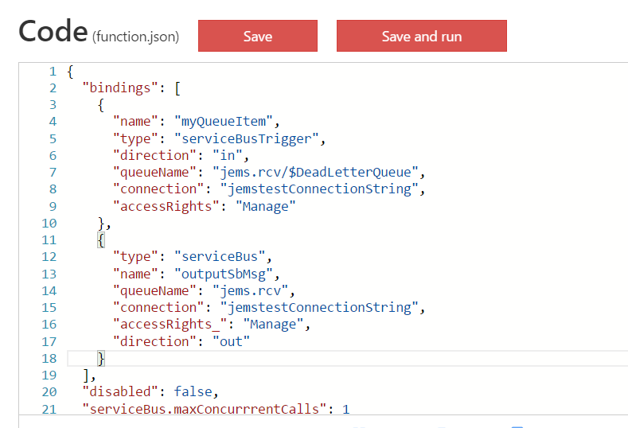

How about an Azure Function to re-evaluate messages on a Service Bus dead-letter queue and send them back to the originating queue?

Great idea! Sadly, when you look at the docmentation regarding the [Azure Functions Service Bus binding](https://docs.microsoft.com/en-us/azure/azure-functions/functions-bindings-service-bus), it does not list the possibility to read messages from a dead-letter queue...

Trying to configure this manual in the UI seems not possible when you try to save it...

 

**How about editing the function.json?**

This file contains de queue names and other Service Bus related settings (such as the maxConcurrrentCalls setting).

Setting the DLQ queue name here, makes it possible to save and run the Function!

**Putting it all together**

Some sample code on how a ReprocessDLQ Function could look like:

