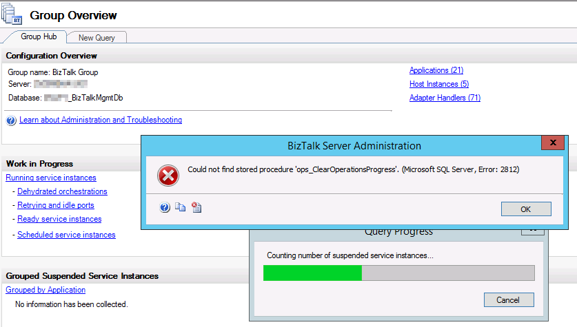
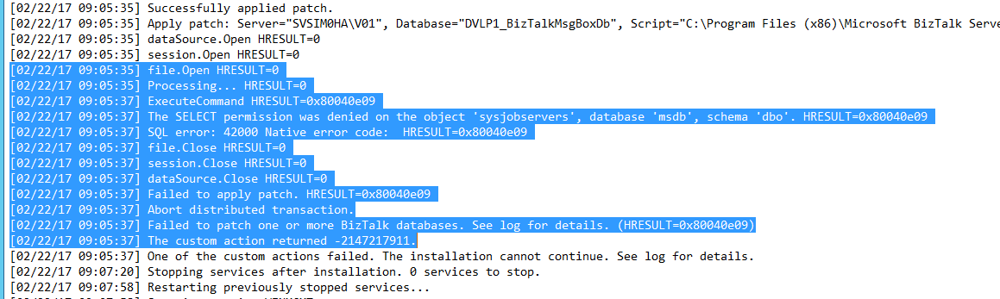

After rolling out BizTalk 2013R2 CU5 on a development server we experienced the following error when loading the group hub: **"Could not find stored procedure 'ops\_ClearOperationsProgress'"**

 

It looked like something when wrong during the installation of the cumulative update. After investigation of the log file, the following SQL error showed up:

**To conclude**: the installation failed because of insufficient SQL access rights.

_(To bad the installer didn't check this requirement before starting the installation...)_

In the end we were able to fix the issue by taking the following steps:

- Providing the SQL sysadmin role
- Uninstalling the CU5 update
- Restoring the BizTalkMsgBoxDb database prior the update
- Installing the CU5 update again

 

My key takeaways regarding BizTalk updates:

- Always test BizTalk updates before rolling them out!
- Create a backup of your BizTalk databases before installing any update - even for your development environments!
- Read the installer log file!
