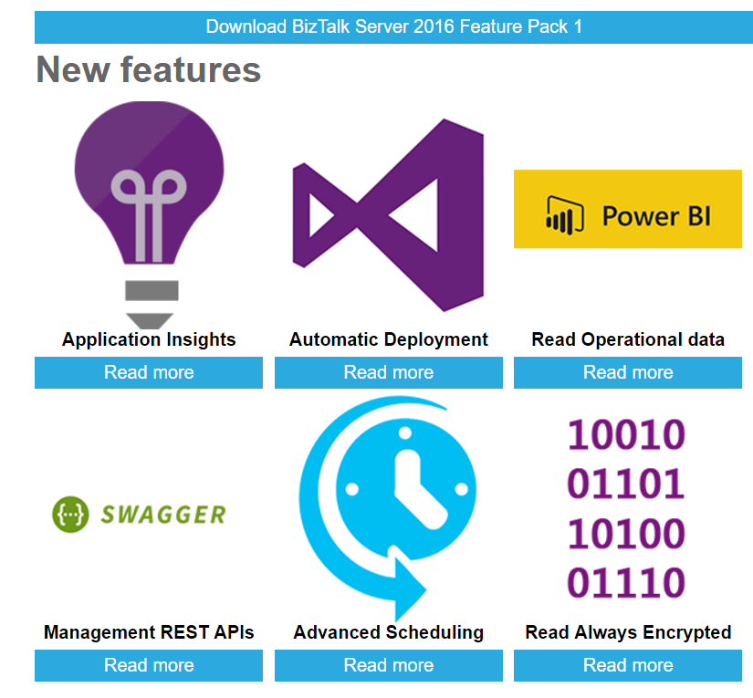
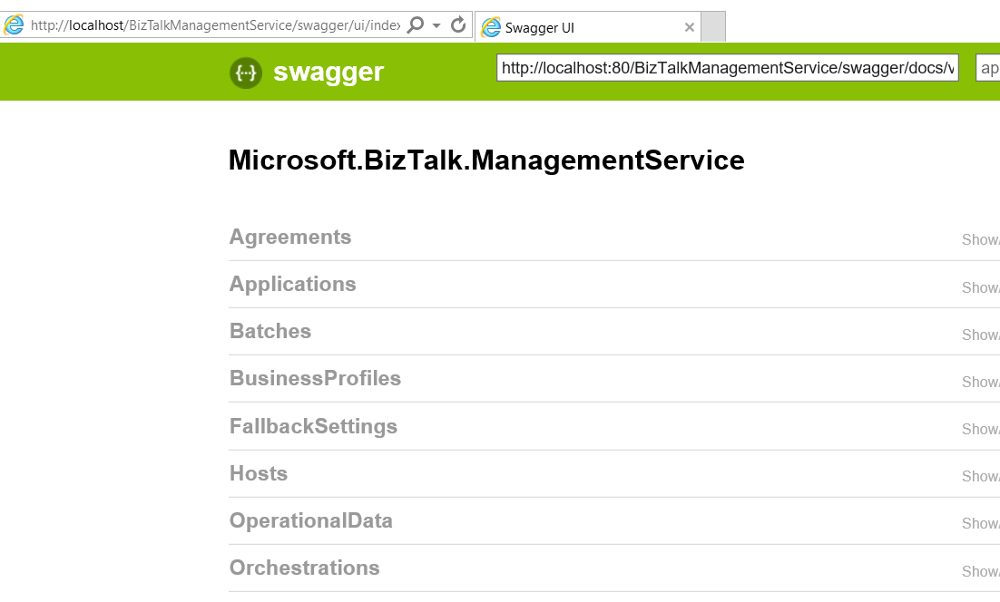

Today Microsoft release the BizTalk Server 2016 Feature Pack 1: [http://biztalkfp1.azurewebsites.net/](http://biztalkfp1.azurewebsites.net/)

I'm was particularly interested in the Management REST APIs, because at the current customer our team has spent a lot of time developing a custom API on top of the ExplorerOM and Operations DLLs. So maybe we could learn something the way Microsoft did this.

**Starting with BizTalk Server 2016 Feature Pack 1**, there's a Windows PowerShell script that installs the REST APIs, and their swagger definitions. Using these APIs, make REST calls to remotely manage your artifacts, including ports, orchestrations, partners, agreements, pipelines, and more. Provides full support of API REST management endpoints with full swagger support.

I went to [this page](https://msdn.microsoft.com/library/mt800832.aspx) on MSDN for the installer instructions. Also BizTalk360 has a nice write up about this topic [here](https://blogs.biztalk360.com/walkthrough-management-rest-api-service-feature-pack-1/).

...

Bot guidelines are NOT complete and are missing the part were you also need to install the 'OperationalData' service via a second command.

To install both the ManagmentService and the OperationalDataService, you need to do it like this:

1\. Open up a Powershell(x86) prompt

2\. Install the ManagementService

FeaturePack.ConfigureServices.ps1 
 -Service **Management** 
 -WebSiteName 'Default Web Site' 
 -ApplicationPool BtsMgmtAppPool 
 -ApplicationPoolUser BtsAdmin 
 -ApplicationPoolUserPassword Azerty123 
 -AuthorizationRoles 'BizTalk Server Administrators'

3\. Install the OperationDataService

FeaturePack.ConfigureServices.ps1 
 -Service **OperationalData** 
 -WebSiteName 'Default Web Site' 
 -ApplicationPool BtsMgmtAppPool 
 -ApplicationPoolUser BtsAdmin 
 -ApplicationPoolUserPassword Azerty123 
 -AuthorizationRoles 'BizTalk Server Administrators'

After that, you can open the Swagger of the ManagementService at [http://localhost/BizTalkManagementService/swagger](http://localhost/BizTalkManagementService/swagger) to start exploring the available methods:

The complete list of available operations is also viewable on MSDN [here](https://msdn.microsoft.com/en-us/library/mt801283.aspx).

After giving it a quick spin, i can conclude that it works great and all methods are doing as they are supposed. But what about HostInstances? It would be very nice to be able to manage them as well via this new API. Just my 2 cents!
