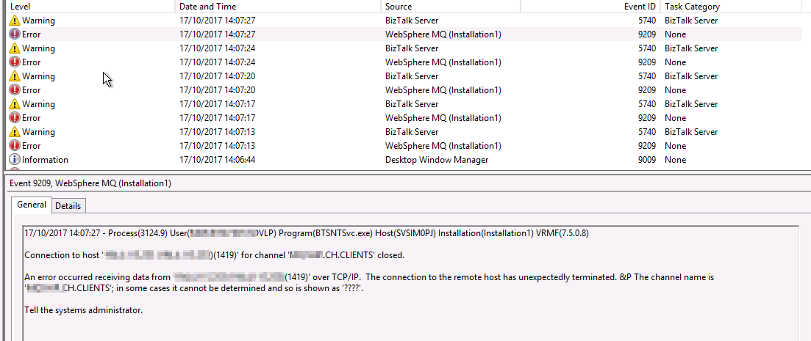
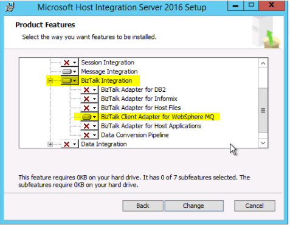
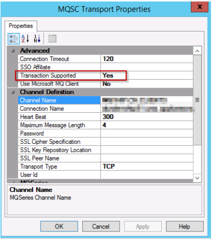

My current customer has an integration landscape with a lot of IBM WebSphere MQ. After an upgrade to IBM WebSphere MQ 9 of a certain queue manager, we were no longer able to receive messages from a queue that was working perfectly before the upgrade. Sending was still working as before.

At that moment in time we were running BizTalk 2013R2 CU7 (_on Windows Server 2012R2_) with Host Integration Server (HIS) 2013 CU4 and using the IBM MQ Client 7.5.0.8 (32 Bit).

Our eventlog was full of these:

This setup was still working perfectly with IBM WebSphere MQ 7 and 8 queue managers. I also tried to update the MQ client to a higher version (8.0.0.7), but this resulted in even more errors...

## The Solution: Host Integration Server (HIS) 2016

When you take a look at the [System Requirements](https://msdn.microsoft.com/en-us/library/mt748660.aspx) of HIS 2016 you see that it supports MQ 8. No mention of  MQ 9, I know... **But it also supports BizTalk Server 2013R2!** At this point we really needed a solution, so we took it for a spin!

I installed and configured everything in following order (the installation is always very import!):

1. Install BizTalk 2013 R2
2. Install BizTalk Adapter Pack
3. Configure BizTalk
4. Install BizTalk 2013 R2 CU7
5. Install .NET 4.6.2 (required for HIS 2016)
6. Install HIS 2016 (no configuration)
7. Install IBM MQ Client 8.0.0.8 (64 Bit)
8. Add MQSC Adapter to BizTalk
9. Install HIS 2016 CU2
10. Reboot Servers

For HIS 2016 I used the following minimal installation (as we only require the MQSC Adapter):

After all of this I was able to successfully do the following:

- **Send and Receive message from IBM WebSphere MQ 9 queues with "Transactional Supported" by using a 64 Bit Host Instance**

## Conclusion

At the end we reached our goal and were able to send and receive messages from an IBM WebSphere MQ 9 queue with BizTalk Server 2013R2.

Some people may ask why I didn't use the **Microsoft MQ Client**. Well, I didn't work straight away and we agreed to not further research this as we already started our migration project to BizTalk Server 2016.
