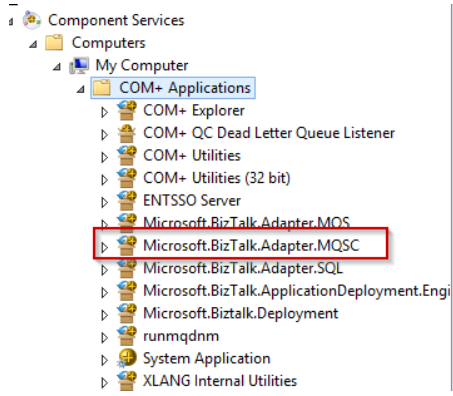

In a [previous blogpost](https://blog.jeroenmaes.eu/2017/11/does-biztalk-2013r2-support-ibm-websphere-mq-9/) I wrote about how you could use HIS2016 together with BizTalk 2013R2 (_on Windows Server 2012R2_) in order to use the MQSC adapter with IBM WebSphere MQ9.

This post is about upgrading an existing configured BizTalk 2013R2 environment without removing your current (port) configuration. **By reading this description you should already know that this involves some "manual" actions...**

These are the steps I followed to upgrade an already configured BizTalk 2013R2 with lots of MQSC SendPorts/ReceiveLocations where I didn't want to remove all the current binding configuration (wich is what you need to do if you want to remove an adapter and follow the normal installation path...).

**Before you start**

- Make sure everything is backed-up correctly
- Stop everything: host-instances, SQL jobs, SSO,..

**Uninstall the old**

- Uninstall the currently installed IBM MQ Client
- Remove the MQSC COM+ Application
- Uninstall HIS2013 (but don't unconfigure anything, just leave the MQSC adapter untouched)

Uninstall MQSC COM+ Application: 
%windir%\\Microsoft.NET\\Framework64\\v4.0.30319\\RegSvcs.exe /u "%snaroot%\\Microsoft.BizTalk.Adapter.MQSC.dll"

**Install the new**

- Install .NET 4.6.2 (.NET 4.6 is a minimal requirement for HIS 2016)
- Install HIS 2016 (no configuration, more details [here](https://blog.jeroenmaes.eu/2017/11/does-biztalk-2013r2-support-ibm-websphere-mq-9/))
- Install IBM MQ Client 8.0.0.8 (64 Bit)
- Install HIS 2016 CU2

**The "manual" part**

- Update the MQSC Adapter info in the BizTalkMgmtDb "Adapter" table
    - Update the AssemblyVersion in InboundTypeName/OutboundTypeName columns to the newer version.

SELECT \* FROM \[BizTalkMgmtDb\].\[dbo\].\[adm\_Adapter\] where name like 'MQSC' 

New InboundTypeName: 
Microsoft.BizTalk.Adapter.Mqsc.MqscReceiver, Microsoft.BizTalk.Adapter.MQSC, Version=10.0.1000.0, Culture=neutral, PublicKeyToken=31bf3856ad364e35, Custom=null

New OutboundTypeName: 
Microsoft.BizTalk.Adapter.Mqsc.MqscTransmitter, Microsoft.BizTalk.Adapter.MQSC, Version=10.0.1000.0, Culture=neutral, PublicKeyToken=31bf3856ad364e35, Custom=null

- Register the MQSC COM+ Application

Install MQSC COM+ Application: 
%windir%\\Microsoft.NET\\Framework64\\v4.0.30319\\RegSvcs.exe "%snaroot%\\Microsoft.BizTalk.Adapter.MQSC.dll"

**Finished!**

- Reboot your server(s)

 

_This worked for a running setup at my current customer. I cannot give you any garantees this will work on your envirenment! Always test this kinds of upgrades before applying this in your production environment!_
