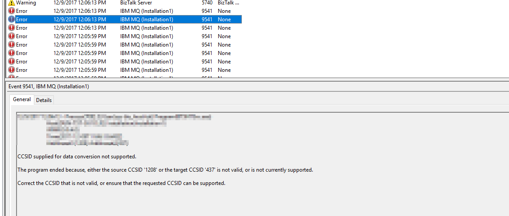
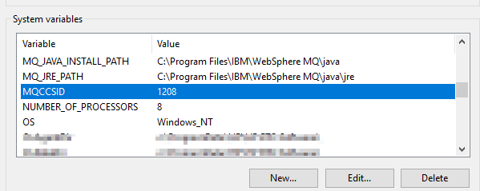
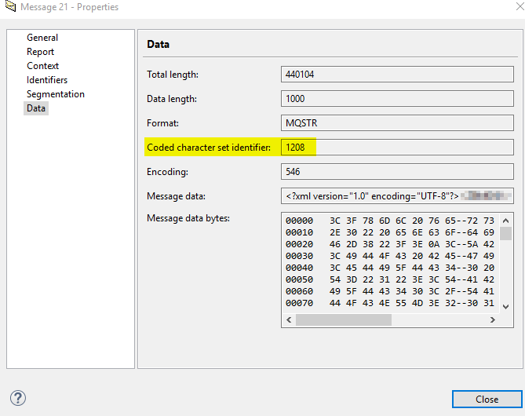

During a smoke test of a new BizTalk Server 2016 (with HIS 2016 and the IBM MQ 8.0.0.8 client) we stumbled upon the following exception:

> "The program ended because, either the source CCSID '1208' or the target CCSID '437' is not valid, or is not currently supported."
> 
> 

In this simple test, we were sending and receiving messages to/from a queue with a couple of ports and did not yet use a pipeline component to set [IBM MQ Series Context Properties](https://docs.microsoft.com/en-us/biztalk/core/mqseries-context-properties).

**But wait, we needed a way to set the CCSID to 1208!**

Luckily, you can set an Environment Variable to specify the desired CCSID globally:

PowerShell (Run as Administrator):

\[Environment\]::SetEnvironmentVariable("MQCCSID", "1208", \[EnvironmentVariableTarget\]::Machine)

> **MQCCSID**: Specifies the coded character set number to be used and overrides the native CCSID of the application. ([IBM Knowledge Center](https://www.ibm.com/support/knowledgecenter/en/SSFKSJ_8.0.0/com.ibm.mq.ref.con.doc/q082720_.htm))

After applying this, the messages were sent using the correct CCSID:

