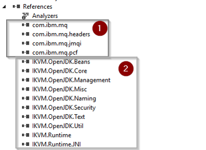

_TL;DR - There is no decent .NET support for PCF in the IBM client, but we can use IKVM.NET to convert JARs to DLLs so we can still use .NET instead of JAVA to use PCF._

## Intro

Programmable Command Formats (PCFs) define command and reply messages that can be used to create objects (Queues, Topics, Channels, Subscriptions,...) on IBM Websphere MQ. For my current project we wanted to build a custom REST API to automate object creation based on our custom needs. The [IBM MQ REST API](https://www.ibm.com/support/knowledgecenter/en/SSFKSJ_9.0.0/com.ibm.mq.adm.doc/q128250_.html) was not a possible alternative at that moment in time.

## The problem

The .NET PCF namespaces are not supported/documented by IBM and do not provide the possibility to inquired the existing subscriptions on a queue manager. All other tasks we wanted to automate are possible in .NET. Using JAVA seemed to be the only alternative if we wanted to build this custom REST API with all features.

<table width="1081"><tbody><tr><td width="292"><b>Action</b></td><td width="545"><b>PCF </b><b>Command</b></td><td width="148"><b>Result</b></td><td width="96"><b>Info</b></td></tr><tr><td width="292"><b>Create</b> <b>Local</b><b>/Alias Queue</b></td><td width="545">MQCMD_CREATE_Q</td><td width="148">OK</td><td width="96"></td></tr><tr><td width="292"><b>Delete Queue</b></td><td width="545">MQCMD_DELETE_Q</td><td width="148">OK</td><td width="96"></td></tr><tr><td width="292"><b>List Queues</b></td><td width="545">MQCMD_INQUIRE_Q</td><td width="148">OK</td><td width="96"></td></tr><tr><td width="292"><b>Purge Queue</b></td><td width="545">MQCMD_CLEAR_Q</td><td width="148">OK</td><td width="96"></td></tr><tr><td width="292"><b>Create Subscription</b></td><td width="545">MQCMD_CREATE_SUBSCRIPTION</td><td width="148">OK</td><td width="96"></td></tr><tr><td width="292"><b>List </b><b>Subscriptions</b></td><td width="545">MQCMD_INQUIRE_SUBSCRIPTION</td><td width="148">NOK</td><td width="96"><u><a href="http://www.mqseries.net/phpBB2/viewtopic.php?t=54444">Link1</a></u></td></tr><tr><td width="292"><b>&nbsp;</b></td><td width="545"></td><td width="148"></td><td width="96"><u><a href="https://www.ibm.com/developerworks/community/forums/html/topic?id=77777777-0000-0000-0000-000014487849">Link2</a></u></td></tr><tr><td width="292"><b>Delete Subscription</b></td><td width="545">MQCMD_DELETE_SUBSCRIPTION</td><td width="148">OK</td><td width="96"></td></tr></tbody></table>

Being able to use the .NET platform was a requirement at that time, because the whole build and deployment pipeline was focused on .NET.

## _IKVM.NET_

After some searching I stumbled upon [IKVM.NET](http://www.ikvm.net/):

"IKVM.NET is a JVM for the Microsoft .NET Framework and Mono. It can both dynamically run Java classes and **can** **be** **used** **to** **convert** **Java** **jars** **into** **.NET** **assemblies**. It also includes a port of the OpenJDK class libraries to .NET.“

Based on this description it sounded like it could offer a possible solution!

Using IKVM.NET we should be able to convert the IBM JARs to .NET assemblies and use the supported and documented IBM Java Packages from a .NET application.

## From JAR to DLL

Now I will shortly explain how we were able to put it all together. Using IKVM.NET is not that easy when you use it for the first time. The whole process consists basically out of 3 steps:

1. Download (and Install) the [IBM MQ redistributable client](https://www.ibm.com/support/knowledgecenter/en/SSFKSJ_9.1.0/com.ibm.mq.ins.doc/q122882_.htm) (in order to extract the JAR files)
2. Convert JARs to DLLs with IKVM.NET
3. Copy DLLs and Reference in .NET project
    - The IBM Converted JARs and the IKVM.NET Runtime dlls

### Convert JAR to DLL

Download IKVM: [https://sourceforge.net/projects/ikvm/](https://sourceforge.net/projects/ikvm/) Extract the IKVM files _(c:\\tools\\IKVM)_ I have the IBM client installed, so the JAR files will be on there default installation (C:\\Program Files\\IBM\\MQ\\java\\lib)

Open up a Command Prompt:

set path=%path%;c:\\tools\\IKVM\\bin

cd C:\\Program Files\\IBM\\MQ\\java\\lib

ikvmc -target:library -sharedclassloader { com.ibm.mq.jar } { com.ibm.mq.jmqi.jar } { com.ibm.mq.headers.jar } { com.ibm.mq.pcf.jar }

You will find the output in the source directory of the JAR files:

### Add References...

Now that we have our DLLs, we can add them to our .NET project. This seemed less easy then I thought, I spend a lot of time figuring out what dependencies I needed. In the end, this was my result:

1 = The IBM JARs converted to DLLs 2 = The IKVM.NET runtime DLLs

### MqPcfAutomation Sample

To help you get started, I added my sample proof of concept solution (.net 4.6.1) [to GitHub in the MqPcfAutomation repository](https://github.com/jeroenmaes/MqPcfAutomation).

_The sample is a showcase of the functionality described in the table at the beginning of this post._

## Conclustion

In the end I am happy that I was able to build a solution for the problem. The question is if this approach is advised... I don't think IBM approves this approach, but it works for what we need it. We are using this solution now for more then 6 months without any issues. In the future we might be able to move to the IBM MQ REST API as more features will be added.
