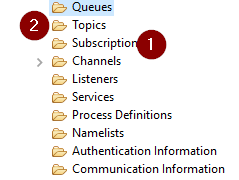

When using the IBM MQ Client library for .NET it is possible to directly make use of “Subscriptions” (1) on IBM MQ, without a topic object (2), by specifying the "TopicString" while sending a message.

The BizTalk MQSC adaptor cannot directly specify a “TopicString” in the adaptor. Also, it is not possible to directly connect to a “Topic” (2) object. It only supports sending to a "Queue" object.

**The Solution:**

It is however, perfectly possible to create a Queue Alias that has a Topic as BaseObject. This Topic can be linked to one or more Subscriptions based on the TopicString.

\[**Queue Alias**, with base object Topic\] ==> \[**Topic**, with TopicString /xyz/\] ====> \[**Subscriptions**, based on TopicString /xyz/\]
