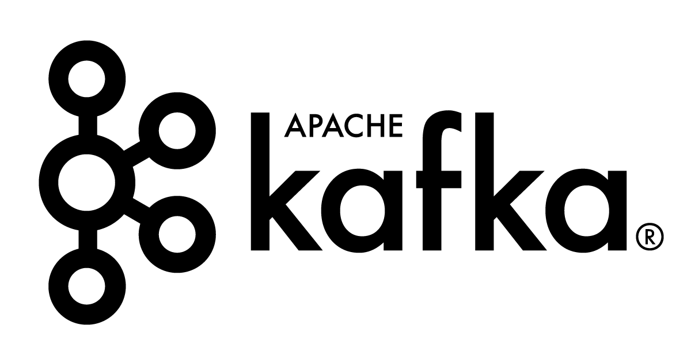
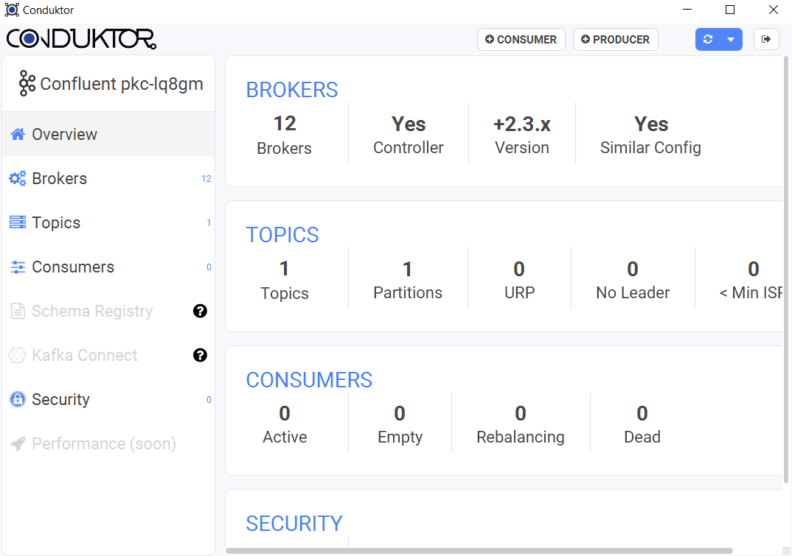

Today I started with the excellent Pluralsight course "[Getting Started with Apache Kafka](https://app.pluralsight.com/library/courses/apache-kafka-getting-started)".

The course is focused on using an Ubuntu test server for Kafka and a Java development environment. This blog post is a list of resources that I found helpful while exploring Apache Kafka, with a focus on the Microsoft stack.

#### Hosting a Kafka environment

Multiple options exist for hosting your test environment. One option is to deploy Apache Kafka in an Azure HDInsight cluster ([quickstart tutorial](https://docs.microsoft.com/en-us/azure/hdinsight/kafka/apache-kafka-get-started) + [Azure Friday](https://www.youtube.com/watch?v=gttwnNDHuZ4)). This option seemed a bit overkill for me as I was searching a "quick start" experience.

Another option are containers. While searching for Docker images, I stumbled upon the [Bitnami Kafka Stack](https://bitnami.com/stack/kafka).  
They offer both Docker and VM images that you can use for running locally on your machine or for deploying to the Azure cloud ([Bitnami Azure Marketplace](https://azuremarketplace.microsoft.com/en-us/marketplace/apps/bitnami.kafka-cluster?tab=Overview)).

But, also this still takes some time before you can connect to your Kafka test cluster. So in the end, I went for a [Confluent Kafka cluster](https://www.confluent.io/download#confluent-cloud), running in Azure. It took me less then 3 minutes to register a new Confluent account, create a new Kafka cluster and connect to it with [Conduktor](https://www.conduktor.io/). This solution is of course not free. Luckily, it is possible to use the Confluent platform for 3 months with a 50 USD spending credit per month.

#### Connecting to Kafka from .NET

When it comes to connecting to Kafka with .NET, there is only one solution you should use and that is "[confluent-kafka-dotnet](https://github.com/confluentinc/confluent-kafka-dotnet)". All other packages are outdated and suggest you should use that one.

As mentioned in the beginning, the Pluralsight is focusing on the Java client for Kafka. Not all concepts are the same when using the Confluent .NET client, therefore you should dig into [the wiki on the GitHub project](https://github.com/confluentinc/confluent-kafka-dotnet/wiki). It provides all info needed to create your first simple [producer](https://github.com/confluentinc/confluent-kafka-dotnet/wiki/Producer) and [consumer](https://github.com/confluentinc/confluent-kafka-dotnet/wiki/Consumer) application. Also, the blogpost '[Designing the .NET API for Apache Kafka](https://www.confluent.de/blog/designing-the-net-api-for-apache-kafka/)' gives some interesting back story.

#### What's next?

After completing the 'getting started course' on Pluralsight I can recommend the following resources to continue your learnings:

- [Introducing Apache Kafka](https://devoxx.be/talk/?id=50292) (Devoxx 2019) _\=> starts with a nice Message Queue vs Event Streams introduction_
- [Kafka: Build, Deploy, and Monitor Your First Real-world Application](https://app.pluralsight.com/library/courses/kafka-build-deploy-monitor-real-world-application) (Pluralsight)
- [A Deep Dive into Apache Kafka - This is Event-Streaming, Not Just Messaging](https://devoxx.be/talk/?id=51736) (Devoxx 2019)
- [What Every Software Engineer Should Know about Apache Kafka: Events, Streams, Tables, Storage, Processing, And More](https://www.michael-noll.com/blog/2020/01/16/what-every-software-engineer-should-know-about-apache-kafka-fundamentals/) (Confluent)
