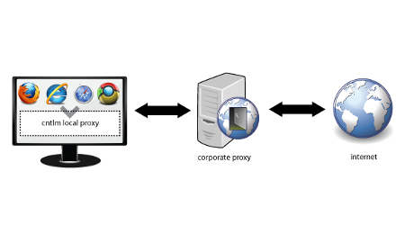

When working in a corporate context, you often get confronted with a corporate web proxy. This can become very annoying when working with various command-line tools that have issues with the authentication part of that web proxy.

Luckily, Cntlm can remove that friction by running a local proxy without authentication, that authenticates to the actual proxy for you.



#### Configuration

1. Download and install Cntlm: [https://sourceforge.net/projects/cntlm/](https://sourceforge.net/projects/cntlm/)  
    It will install itself under"C:\\Program Files (x86)\\Cntlm"
2. Edit "Cntlm.ini" and fill in your Username, Domain and Proxy. Remove the plain text password property and save the file.
3. Use "cntlm -H" to generate a new password hash. Copy the PassNTMLv2 hash to the Cntlm.ini file.
4. Start the Cntlm service using "net start cntlm"
5. Now you can use your local proxy (without authentication) at [http://localhost:3128/](http://localhost:3128/)

#### Conclusion

You only need 4 properties in the Cntlm.ini file to get Cntlm running in a secure way:

```
Username	testuser
Domain		corp-uk
Proxy		10.0.0.41:8080
PassNTLMv2      <output from cntlm -H>
```

#### Links

- [https://stackoverflow.com/questions/9181637/how-to-fill-in-proxy-information-in-cntlm-config-file](https://stackoverflow.com/questions/9181637/how-to-fill-in-proxy-information-in-cntlm-config-file)
