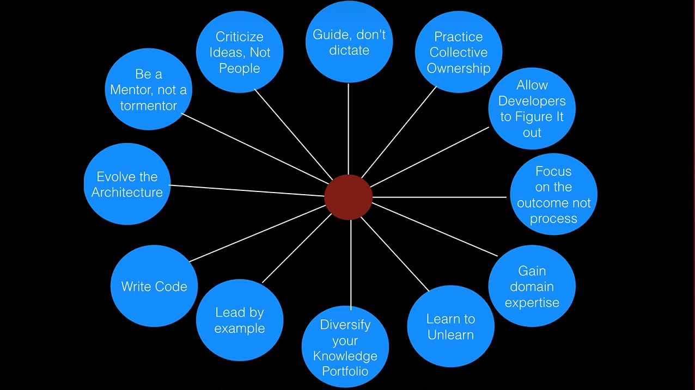

Recently I came across an excellent talk from Devoxx 2019: Qualities of a Highly Effective Architect by Venkat Subramaniam.

https://www.youtube.com/watch?v=QeKheNfO3Yg

[Link to slides (PDF)](https://www.agiledeveloper.com/presentations/qualities_of_a_highly_effective_architect.pdf)

In this talk, Venkat discusses 12 qualities an effective architect should have. Also, he mentions an old article by Martin Fawler called "[Who needs an architect](http://files.catwell.info/misc/mirror/2003-martin-fowler-who-needs-an-architect.pdf)".

Both the talk and the article are great resources to understand what an architect is and what qualities he should possess.

