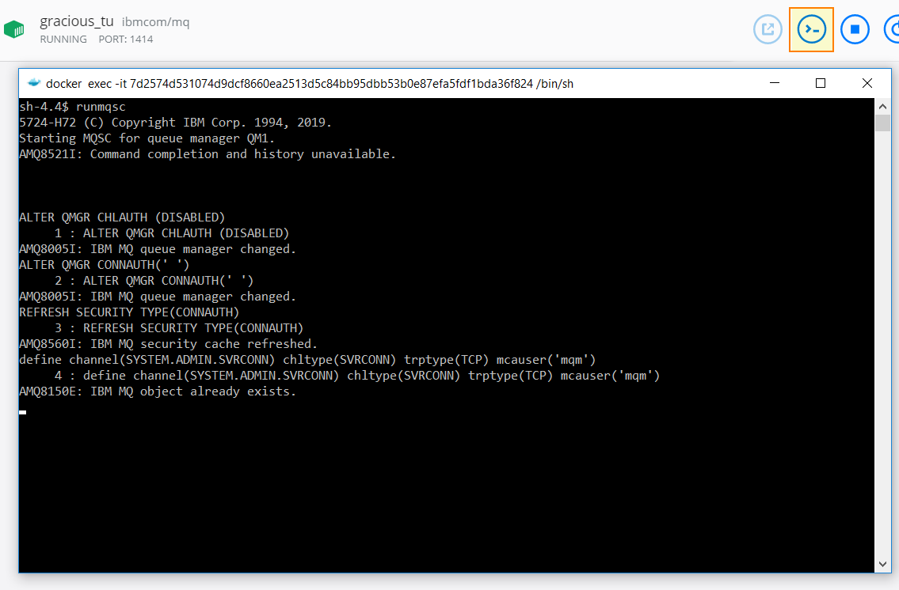

In a [previous blogpost](https://blog.jeroenmaes.eu/2017/12/how-to-configure-a-local-ibm-mq-development-environment/), I described how you can install IBM MQ on your local development machine. This is still a lot of work just to get MQ up and running...

This post describes how to run IBM MQ in Docker and get you up and running **in less than 5 minutes!** _(you should have of course already a working installation of Docker Desktop on your machine)_

The official GitHub repository of the MQ Container can be found here: [https://github.com/ibm-messaging/mq-container](https://github.com/ibm-messaging/mq-container).

**Step 1 - Run MQ with default config**

These instructions are based on the official [usage documentation](https://github.com/ibm-messaging/mq-container/blob/master/docs/usage.md). In this example, I will not use the [default MQ\_DEV config](https://github.com/ibm-messaging/mq-container/blob/master/docs/developer-config.md).

```
# get image
docker pull ibmcom/mq

# create volume to sore settings and messages
docker volume create qm1data

# run container without default mq_dev config and attach the new volume
docker run --env LICENSE=accept --env MQ_QMGR_NAME=QM1 --env MQ_DEV=false --publish 1414:1414 --publish 9443:9443 --detach --volume qm1data:/mnt/mqm ibmcom/mq

# login to web console
https://localhost:9443/
u:admin	
p:passw0rd
```

**Step 2 - Disable security**

The default configuration has security configured out of the box. And that is a good thing! But it might be a bit annoying for local development.

Connect to your container using the cli. Use runmqsc to disable security and create a new channel that runs under the mqm user.

```
runmqsc

ALTER QMGR CHLAUTH (DISABLED)
ALTER QMGR CONNAUTH(' ')
REFRESH SECURITY TYPE(CONNAUTH)
define channel(DEMO.ADMIN.SVRCONN) chltype(SVRCONN) trptype(TCP) mcauser('mqm')
```



At this point, security is disabled and the channel "DEMO.ADMIN.SVRCONN" can be used for messaging (from Java / .NET) and admin purposes (MQ Explorer) without any security.

**DISCLAIMER: you should only disable security like this in a development scenario!**
