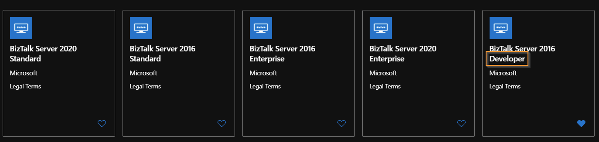
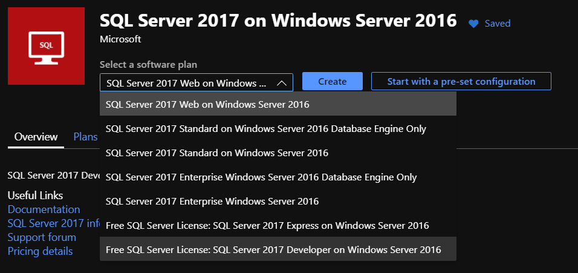
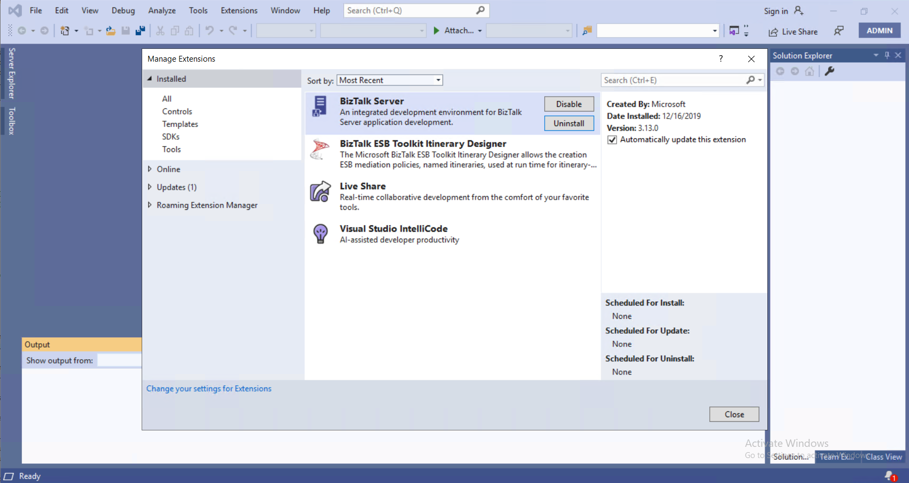

As of today, there is still no BizTalk Server 2020 Developer VM image available in Azure.

So, what do we need to do to configure a developer environment in Azure?

Here are some easy steps to get you up to running in no time:

_Disclaimer: an MSDN subscription is required to make use of developer licenses._

Step 1: Create a new VM based on the "SQL Server 2017 on Windows Server 2016 image":

**Why? It is possible to assign this image a "free developer license". This image also comes with SQL Server 2017 (and Management Studio) installed and preconfigured.**

Step 2: Download and install Visual Studio 2019 Professional

Step 3: Download, install and Configure BizTalk Server 2020 Developer Edition from MSDN.

Step 5: Install the BizTalk Server Developer tools ([more info there](https://docs.microsoft.com/en-us/biztalk/install-and-config-guides/install-biztalk-server-2020))

NEW: With Visual Studio 2019 and BizTalk Server 2020, the Developer tools are now installed using a separate plugin.

Conclusion: In 5 easy steps, my development environment was ready in about 2 hours. The VM size used was a "Standard D4s v3 (4 vcpus, 16 GiB memory)".
