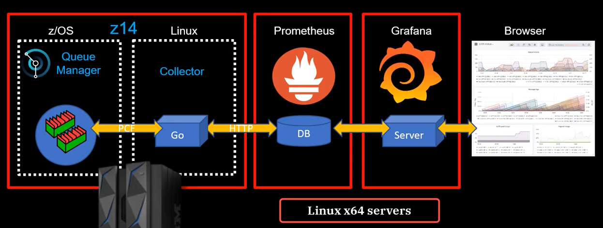
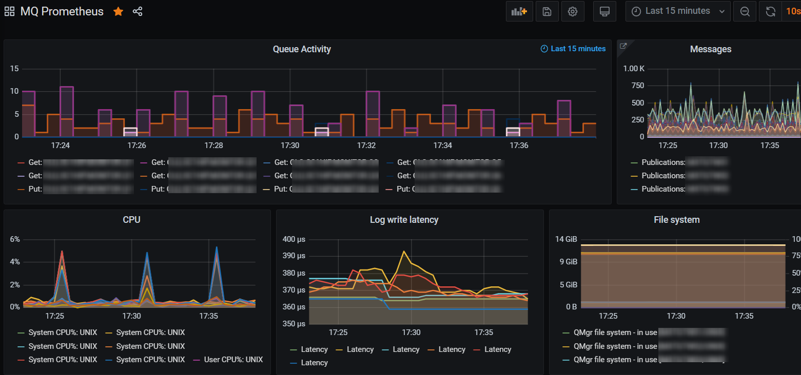

IBM provides a [sample](https://github.com/ibm-messaging/mq-metric-samples/tree/master/cmd/mq_prometheus) "MQ Exporter for Prometheus monitoring" on [GitHub](https://github.com/ibm-messaging/mq-metric-samples/tree/master/cmd/mq_prometheus). (the original article introducing this sample can be found [here](https://community.ibm.com/community/user/imwuc/viewdocument/using-prometheus-and-grafana-to-mon?CommunityKey=183ec850-4947-49c8-9a2e-8e7c7fc46c64&tab=librarydocuments) on the IBM Community site)

A simple graphical overview illustrates the overall monitoring setup:

> The "collector" will retrieve statistics from the IBM MQ queue manager using PCF. It will expose them over HTTP to Prometheus. Prometheus scrapes the metrics and stores them in its database. Grafana is used for showing the data on a dashboard (also available in the samples provided by IBM).

The "collector" is written in GO, we only need to build it from the source in order to use it.

**Building the collector for Windows**

> Install go ( [https://golang.org/dl/](https://golang.org/dl/) )  
> Install tdm-gcc ( [https://jmeubank.github.io/tdm-gcc/download/](https://jmeubank.github.io/tdm-gcc/download/) )  
> Install full mq client for windows ( [https://www.ibm.com/support/pages/mqc91-ibm-mq-clients](https://www.ibm.com/support/pages/mqc91-ibm-mq-clients) )
> 
> git clone https://github.com/ibm-messaging/mq-metric-samples.git c:\\src  
> cd c:/src/cmd/mq\_prometheus  
> go build -o ./bin/mq\_prometheus.exe

**Running the collector**

> The mq\_prometheus.exe binary takes a configuration file using the -f parameter. In this file (a combination of the config.collector.yml and config.common.yml sample) you can specify the connection details and the objects you want to monitor.
> 
> Important to understand is that you can only monitor a single queue manager at a time. If you have multiple queue managers you want to monitor, you'll need multiple instances of the collector each with their own config file.
> 
> _mq\_prometheus.exe -f config.qm01.yaml_

**Scraping with Prometheus**

> Let's say I have 5 queue managers. This results in 5 collectors that are exposing metrics on a different port. In your Prometheus config, you will need to add the address + port of these endpoints. Prometheus will start scraping the metrics once started.

**Dashboards with Grafana**

> The final step is to link Grafana to your Prometheus instance and import a dashboard. The "MQ Prometheus-1541759594068.json" dashboard is a nice start to explore the available metrics, it gives you a global overview of your queue managers.

**AlertManager**

> The next logical step is to configure the Prometheus AlertManager. Now that we have all our metrics in Prometheus and are able to explore them with Grafana, we can better understand them and build alerts and do something useful with the data.
