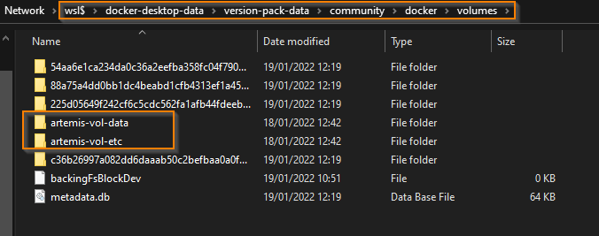
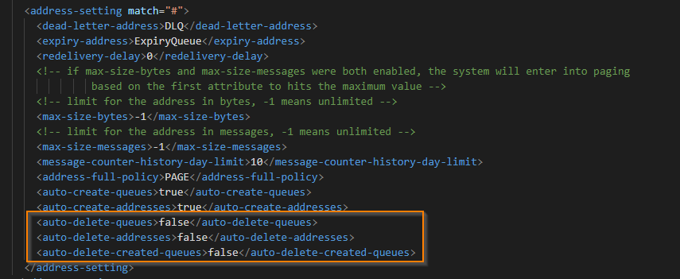
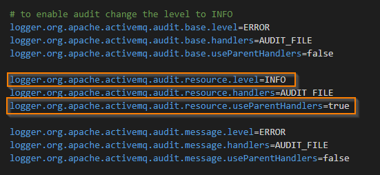
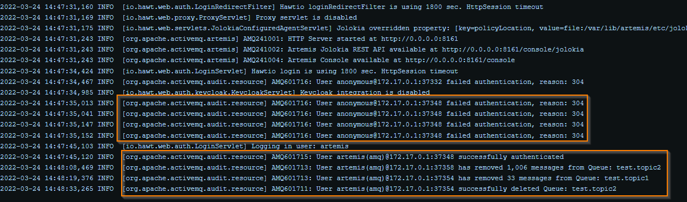

The Redhat AMQ Broker docker images are not publicly available for download... (more on this in a follow-up post)

While investigating some of the AMQP client connection options for .NET I had to find an alternative solution.
Luckily, Redhat AMQ Broker is basically just ActiveMQ Artemis under the hoods.

After a litte search I found a valid image for my test scenario that works on Docker Desktop, without extra config: https://github.com/qoricode/activemq-artemis-docker

My setup makes use of 2 persited volumes to not lose any config/data after a restart of your container.
```

##Create volumes
docker volume create artemis-vol-data
docker volume create artemis-vol-etc

#Pull image
docker pull qoricode/activemq-artemis

#Run container
docker run -it --rm -p 8161:8161 -p 61616:61616 --name artemis -v artemis-vol-data:/var/lib/artemis/data -v artemis-vol-etc:/var/lib/artemis/etc qoricode/activemq-artemis

#Login to web portal
http://localhost:8161/console/artemis
u: artemis 
p: simetraehcapa

```


A link to my initial amqpnet test console project: https://github.com/jeroenmaes/amqp-test-console

After some trial and error I decided to switch to another library for connecting to the Artemis message broker. The artemis-net-client adds support for fail-over and resiliency out of the box:
https://github.com/jeroenmaes/amqp-test-console/tree/artemis-client

To validate the content of the mounted volums in Docker Desktop on windows, you can browse the following path:
```
\\wsl$\docker-desktop-data\version-pack-data\community\docker\volumes\
```



This makes it easy to edit the "broker.xml" and set your preferred "auto-delete" settings:



More on these settings in the official documentation: https://activemq.apache.org/components/artemis/documentation/latest/address-settings.html

Another interesting one is to change the logging to your needs in the "logging.properties":



The highlighted settings will log all changes on resources:


More on these settings in the official documentation: https://activemq.apache.org/components/artemis/documentation/latest/logging.html

-- Happy messaging!

