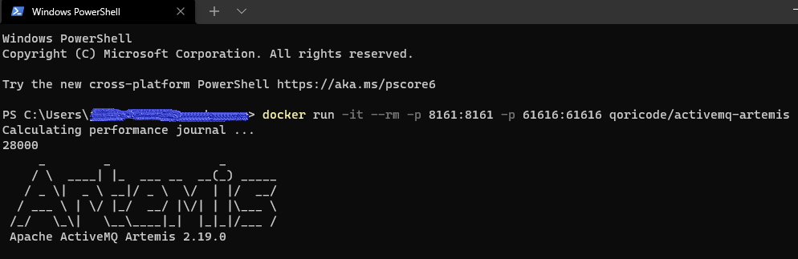

The Redhat AMQ Broker docker images are not publicly available for download...

While investigating some of the AMQP client connection options for .NET I had to find an alternative solution.
Luckily, Redhat AMQ Broker is basically just ActiveMQ Artemis under the hood.

After a litte search I found a valid image for my test scenario that works on Docker Desktop: https://github.com/qoricode/activemq-artemis-docker

```

##Create volumes
docker volume create artemis-vol-data
docker volume create artemis-vol-etc

#Pull image
docker pull qoricode/activemq-artemis

#Run container
docker run -it --rm -p 8161:8161 -p 61616:61616 --name artemis -v artemis-vol-data:/var/lib/artemis/data -v artemis-vol-etc:/var/lib/artemis/etc qoricode/activemq-artemis

#Login to web portal
http://localhost:8161/console/artemis
u: artemis 
p: simetraehcapa

```


Link to my amqpnet test console project: https://github.com/jeroenmaes/amqp-test-console

To validate the content of the mounted volums in Docker Desktop on windows, browse the following path:
```
\\wsl$\docker-desktop-data\version-pack-data\community\docker\volumes\
```
