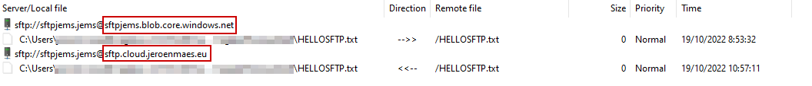

Azure storage accounts now support SFTP for accessing your Blob data: https://learn.microsoft.com/en-us/azure/storage/blobs/secure-file-transfer-protocol-support

But did you also knew you can easily add a custom hostname?

Since the SFTP protocol does not use HTTPS, you don't need to bother with custom certificates.
You only need to add a CNAME that points to your storage account.

```
my_storage_account.blob.core.windows.net CNAME sftp.custom.domain.com
```

Currently this is not possible to configure using the Azure Portal, you need Azure Powershell to update the storage account:
https://learn.microsoft.com/en-us/azure/storage/blobs/storage-custom-domain-name?tabs=azure-powershell#endpoint

```
Install-Module Az.Storage -AllowClobber
Connect-AzAccount
Set-AzContext xyz
Set-AzStorageAccount -ResourceGroupName rg-sftp -Name sftpjems -CustomDomainName sftp.cloud.jeroenmaes.eu -UseSubDomain $false

```

Result:



Original source post on Microsoft Learn: https://learn.microsoft.com/en-us/answers/questions/759531/azure-blob-sftp-custom-domain.html