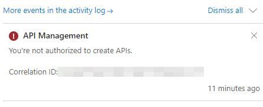
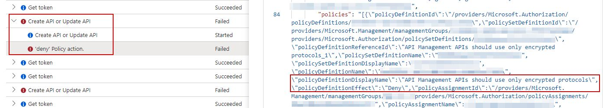

Today I stumbled upon an unclear error message in the Azure Portal while importing an API in API Management using the wizard:

**The message didn't make much sense to me as I clearly was owner on the specific subscription where the APIM instance was deployed.**

Digging a bit deeper in the Azure Portal activity log showed that the error was not related to any missing permissions, but that my request was blocked by the "API Management APIs should use only encrypted protocols" Azure Policy:

More info related to Azure APIM Policies: https://learn.microsoft.com/en-us/azure/api-management/policy-reference

**After selecting the "HTTPS" only protocol radio button during the import, the error message was gone.**

Simple fix, but the error message in the Azure Portal could have been a bit more helpful...