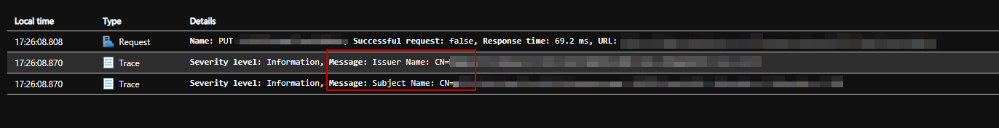

mTLS is used very often in enterprise integration scenarios.
Testing this kind of security implementation always requires a lot of effort by both parties.

Being able to log/trace the actual used Subject and IssuerName can yelp quite a lot.
By usin the [trace policy of APIM](https://learn.microsoft.com/en-us/azure/api-management/trace-policy) we can log the values straight to Application Insights:

```
<policies>
    <inbound>
        <base />
        <choose>
            <when condition="@(context.Request.Certificate != null)">
                <trace source="My Secure API" severity="information">
                    <message>@($"Subject Name: {context.Request.Certificate.SubjectName.Name}")</message>
                </trace>
                <trace source="My Secure API" severity="information">
                    <message>@($"Issuer Name: {context.Request.Certificate.IssuerName.Name}")</message>
                </trace>
            </when>
        </choose>       
    </inbound>
    <backend>
        <base />
    </backend>
    <outbound>
        <base />        
    </outbound>
    <on-error>
        <base />
    </on-error>
</policies>
```

The result in Application Insights for an API request when a Client Certificate is provided:




